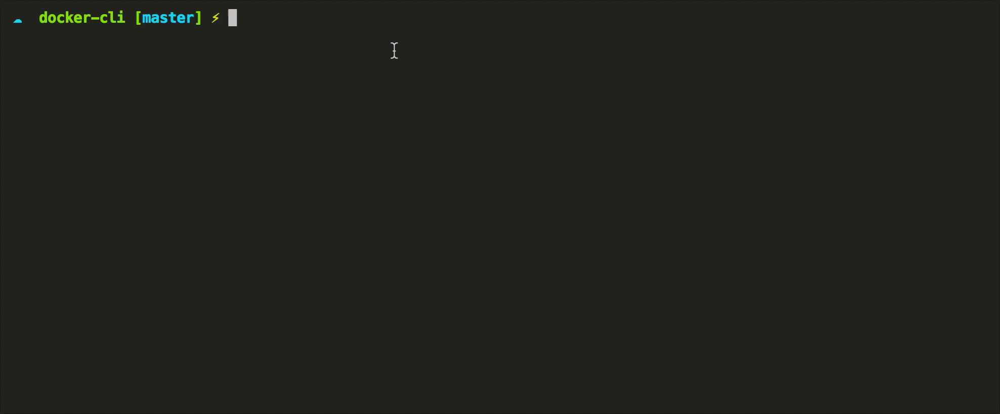
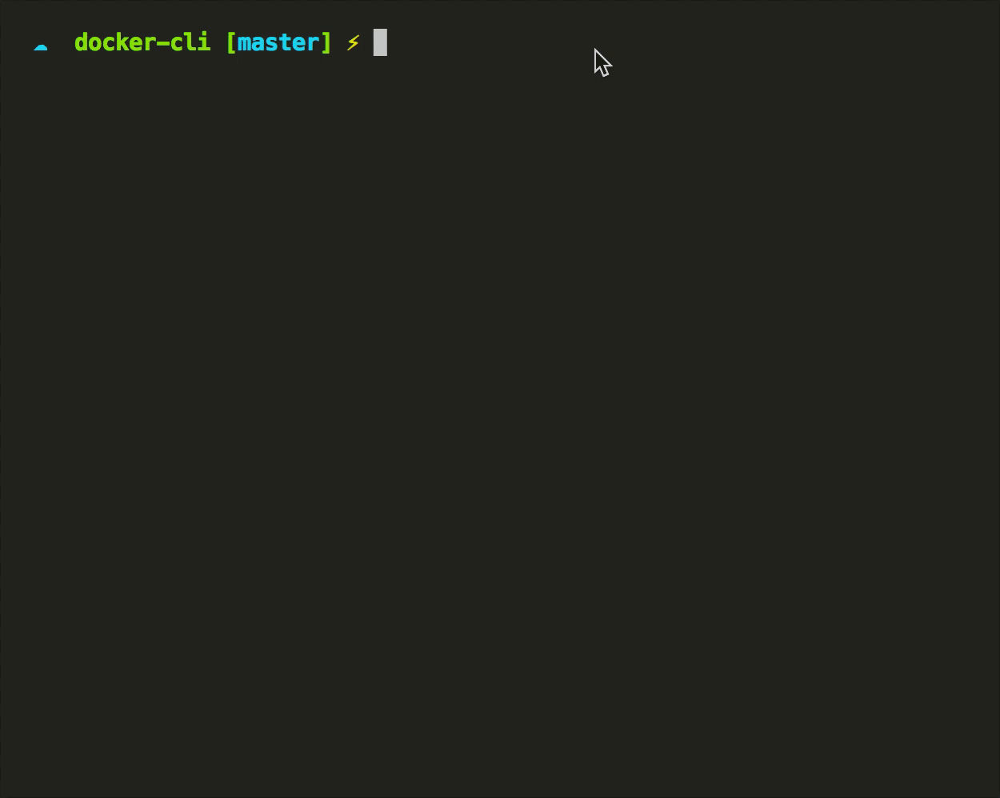

# Docker Command Line


### How to use
```sh
git clone https://github.com/Weerapat1993/docker-cli.git
sudo npm i -g
dcoker-cli
```

### Docker Status



### Docker Create Container



### Create MongoDB
```sh
docker run --name mongodb -p 27017:27017 -d mongo
```
### Create MySQL Server
```sh
docker run --name mysql_db_server -p 3306:3306 -e MYSQL_ROOT_PASSWORD=1234 -d mysql
docker run --name phpmyadmin -d --link mysql_db_server:db -p 8080:80 phpmyadmin/phpmyadmin
```

